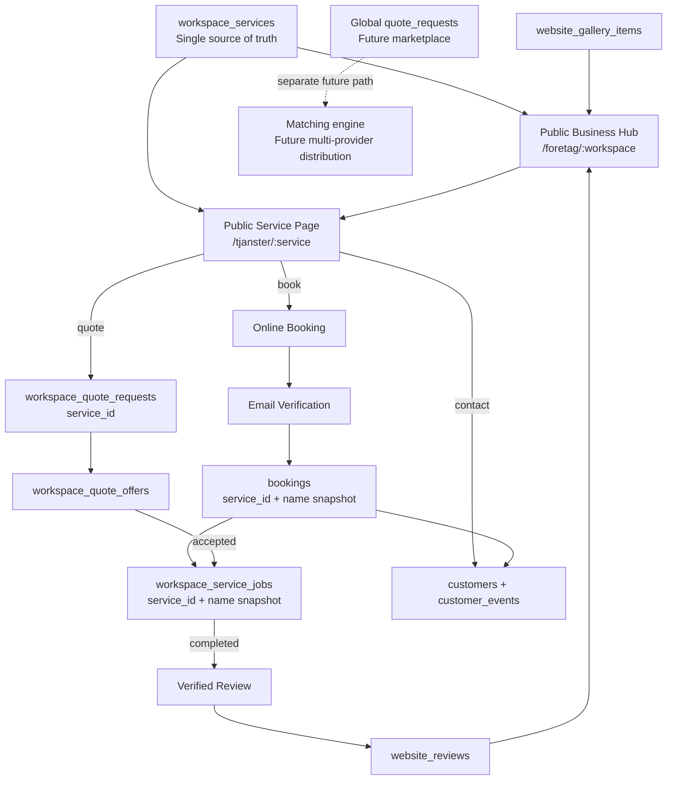
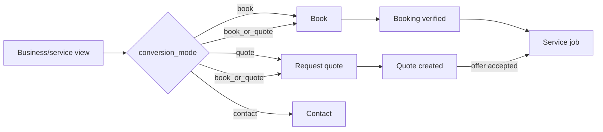

# Public Business Hub

Status: implementation branch `work/proffera-public-business-hub`.

## Product decision

`workspace_services` remains the single service source of truth. The public business site is a presentation and conversion layer over the same workspace-owned services used by booking, quotes, CRM and fulfillment.

The existing global `quote_requests` / matching path remains reserved for a future multi-provider marketplace. It is not merged into the direct workspace quote flow.

## System graph

## Identity invariants

1. Service UUID is the durable identity. Service names remain human-readable historical snapshots.
2. Booking selection is submitted and resolved by `service_id`, never by a mutable service name.
3. Direct quote requests already use `service_id` and remain workspace-owned.
4. Service jobs derive `service_id` from their booking or quote request where possible. A database trigger prevents a service from another workspace being attached to a job.
5. `is_active` is operational availability. `public_status` is public visibility. They are intentionally independent.
6. `price_type` describes price semantics. `conversion_mode` describes the customer action. They are intentionally independent.
7. Existing custom domains remain booking-first because `public_home_mode` defaults to `booking`.
8. Public funnel telemetry contains no customer name, email, phone, quote text or booking details.

## Public conversion graph

## Public URLs

Platform-hosted:

- `/foretag/{workspace-slug}`
- `/foretag/{workspace-slug}/tjanster/{service-slug}`
- `/boka/{booking-slug}?service_id={service-uuid}`

A connected custom domain keeps its current booking root until the workspace manager explicitly chooses `Företagssida`. The domain itself is not detached or recreated.

## Theme strategy

The hub reuses `workspace_experience_settings`: logo, hero media, primary/accent colors, appearance and section toggles. No second theme engine is introduced.

## Rollout loop

1. Apply migration `20260809_0036_public_business_hub.sql` on a disposable/temporary database branch.
2. Verify service/booking/job backfills and tenant constraints.
3. Run unit tests, typecheck, lint and production build.
4. Validate one workspace with a draft service; no public behavior should change.
5. Publish one service and validate direct service URL.
6. Validate booking deep-link keeps the service UUID through email verification into `bookings.service_id`.
7. Validate direct quote creates `workspace_quote_requests.service_id`.
8. Validate accepted quote or booking-derived service job carries the same service identity.
9. Enable `public_home_mode=website` only for a test workspace/custom domain.
10. Validate rollback by switching the mode back to `booking`; no DNS/domain change is required.

## Rollback boundary

The migration is additive. Public services default to draft and custom domains default to booking. If the public hub must be disabled after deployment:

- switch `public_home_mode` back to `booking`;
- set affected services to `hidden` or `draft`;
- keep `service_id` columns and historical snapshots; they are backward-compatible identity hardening and should not be dropped during an application rollback.

Do not advance the global marketplace/matching path as part of this rollout.
